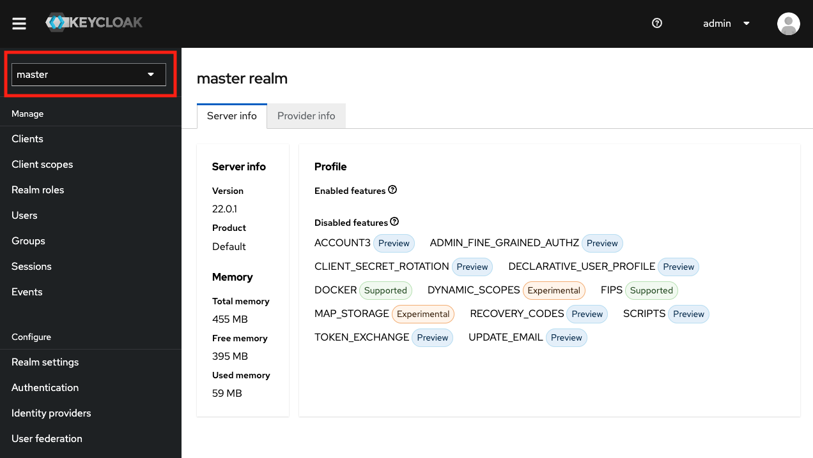
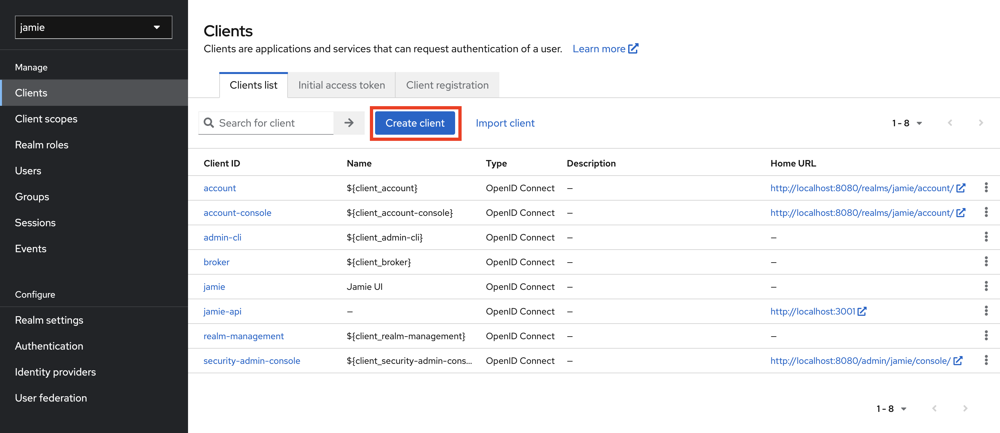
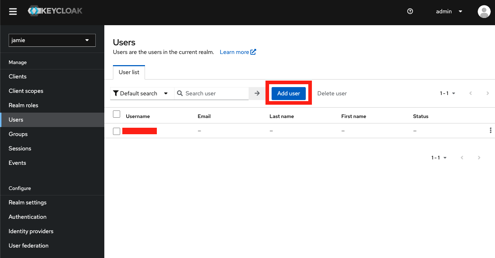

# Jamie Auth Service

## Descrição

Este projeto contém o Keycloak, necessário para subir os projetos [Jamie API](https://github.com/bancodobrasil/jamie-api) e [Jamie UI](https://github.com/bancodobrasil/jamie-ui)

## Dependências

- [Docker](https://www.docker.com/)

## Instalação

### Com o Docker Compose (Recomendado)

O projeto [Jamie UI](https://github.com/bancodobrasil/jamie-ui) já contém um arquivo `docker-compose.yaml`, o que tornará mais fácil executar o Keycloak em um ambiente local.

Você pode verificar o comando para iniciar o serviço Keycloak do docker-compose no repositório do projeto anterior.

### Com o Docker

Abra o terminal no projeto jamie auth service. Em seguida, rode o comando do Docker: 

```bash
 docker build -t keycloak .
 docker run -d -p 8080:8080 --name keycloak keycloak
```

## Configurando o Keycloak

Em `localhost:8080`, carregará uma tela semelhante a a seguir:


Clique em `Administration Console`, abrirá uma tela de login, digite na tela
username: `admin` e password: `admin`. Se iniciará uma tela semelhante a a seguir:

    Username: admin
    Password: admin

Após isso, você precisará criar o `realm`. Para fazer isso, clique na área demarcada em vermelho na imagem. Sob a seção "Master", você encontrará a opção para criar um novo Realm.



Ao abrir essa opção, a tela apresentará:


Em **Realm name** digite `jamie`, em seguida clique em create. Na tela inicial do Keycloak, no mesmo lugar em que foi clicado para criar um Realm aparecerá o Realm jamie que acabamos de criar, entre nele. 


Em seguida no menu lateral clique em **Clients** e abrirá uma tela semelhante a seguir:



Clique em **Create Client**, iremos criar dois clientes, um para a Jamie UI e outro para Jamie API.

### Configuração Client Jamie UI
Preencha os campos com os seguintes dados:
 
1. **Client ID**: jamie

2. **Name**: Jamie UI

3. Em **ACCESS Settings** coloque:
    - **Valid Redirect URIs**: 
        - http://localhost:80/* 
        - http://localhost:3000/*
        - http://localhost/*

    - **Valid post logout redirect URIs**: 
        - http://localhost:80/* 
        - http://localhost:3000/*
        - http://localhost/*

    - **Web origins**: 
        - http://localhost:80
        - http://localhost:3000
        - http://localhost

4. Em **Capability config**

    **Desmarque**:
    - Client authentication
    - Authorization
    
    **Habilite(ON)**:
    - Standard flow
    - Direct access grants

### Configuração Client Jamie API
Preencha os campos com os seguintes dados:
 
1. **Client ID**: jamie-api

2. Em **ACCESS Settings** coloque:
    - **Root URL**: 
        - http://localhost:3001/*

    - **Home URL**: 
        - http://localhost:3001/*

    - **Admin URL**:    
        - http://localhost:3001

3. Em **Capability config**

    **Habilite(ON)**:
    - Client authentication
    - Authorization
    
    **Desmarque**:
    - Standard flow
    - Direct access grants

### Configuração Realm Roles

Agora precisaremos configurar os Realm Roles, serão criados 4 realms roles (reader, editor, manager, admin [opcional]). No menu lateral clique em **Realm Roles**, em seguida abrirá uma tela semelhante a seguir, e clique em **Create Role**.


Preencha os campos com os seguintes dados:

#### Reader
1. **Role name**: reader
2. Salve

#### Editor
1. **Role name**: editor
2. Em **Action** clique em **Add associated roles**, em seguida clique no role do `reader`, que criamos, e em **Assign**
3. Salve

#### Manager
1. **Role name**: manager
2. Em **Action** clique em **Add associated roles**, em seguida clique no role do `reader` e `editor`, que criamos, e em **Assign**
3. Salve

#### Admin
1. **Role name**: admin
2. Em **Action** clique em **Add associated roles**, em seguida clique no role do `reader`, `editor` e `manager`, que criamos, e em **Assign**
3. Salve


### Configuração de Usuário

No menu lateral, cliente en **Users**, em seguida clique em **Add user**, como na imagem a seguir:




Em **Username** digite um nome de usuário que você deseja, e habilite **Email verified**, não é necessário adicionar seu e-mail, apenas se você quiser.

Em seguida, clique em **Credentials** e **Set password**.


Preencha a senha e a confirmação da senha e desabilite o campo de **Temporary**. Em seguida, clique em **Role mapping**, que está ao lado de **Credentials**. Em seguida clique em `admin` e em **Assign**.

Com isso, quando entrar no Jamie UI será necessário colocar o usuário e a senha que você cadastrou.


### Jamie API e UI

Em seguida, faça os processos do README do [Jamie API](https://github.com/bancodobrasil/jamie-api) ou do [Jamie UI](https://github.com/bancodobrasil/jamie-ui).
