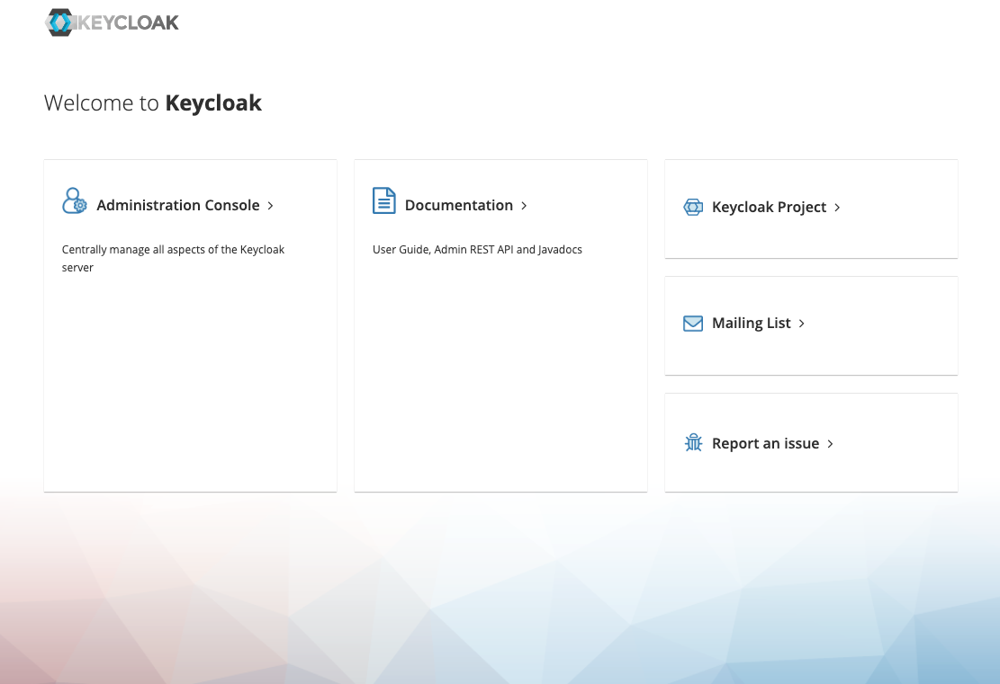
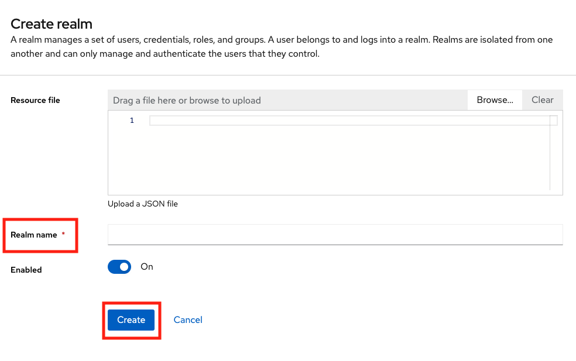
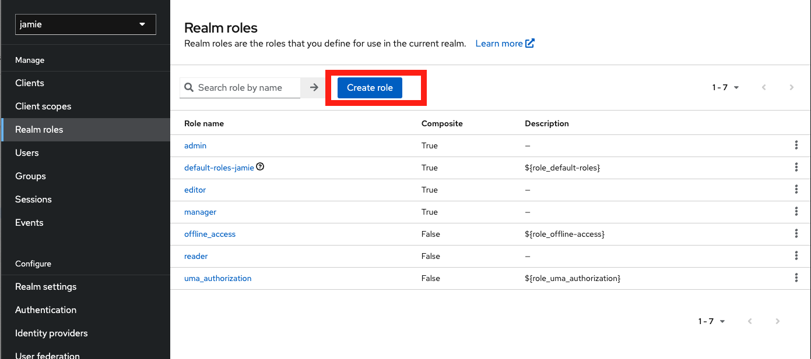
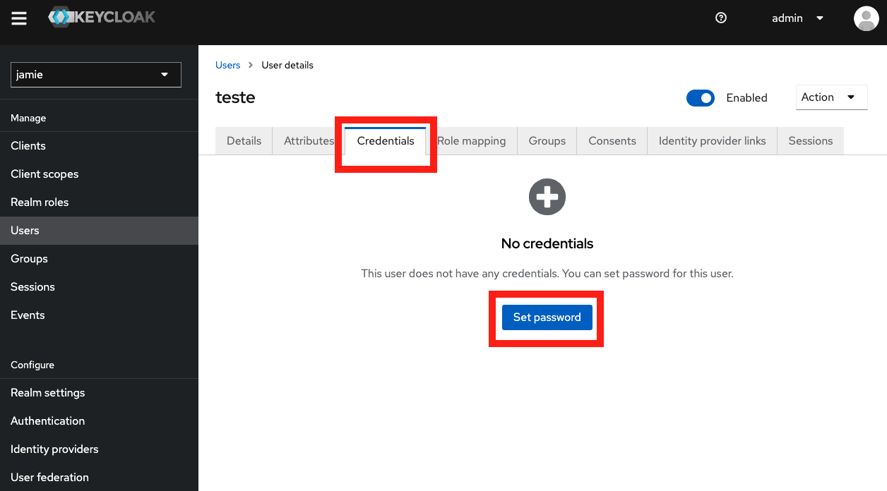

# Jamie Auth Service

Alternative languages:

[Leia a página em Português Brasileiro ](https://github.com/bancodobrasil/jamie-auth-service/blob/develop/README-PTBR.md) 

## Description

This project contains KeyCloak, which is necessary to set up the [Jamie API](https://github.com/bancodobrasil/jamie-api) and [Jamie UI](https://github.com/bancodobrasil/jamie-ui) projects.

## Dependencies

- [Docker](https://www.docker.com/)

## Installation

Open the terminal in the Jamie Auth Service project directory. Then, run the Docker command:

```bash
docker build -t keycloak .
docker run -d -p 8080:8080 --name keycloak keycloak
```

## Setting Up KeyCloak

In `localhost:8080`, a screen similar to the following will load:



Click on `Administration Console`, and a login screen will open. Enter the following credentials:

    Username: admin
    Password: admin

Afterward, you will need to create the `realm`. To do this, click on the area marked in red in the image. Under the "Master" section, you will find the option to create a new Realm. Upon opening this option, the screen will display:



In **Realm name**, type `jamie`, then click create. On the initial Keycloak screen, where you clicked to create a Realm, the newly created `jamie` Realm will appear. Enter it.

Next, in the side menu, click on **Clients**, and a screen similar to the following will open:


Click on **Create Client**, and we will create two clients, one for Jamie UI and another for Jamie API.

### Jamie UI Client Configuration
Fill in the fields with the following data:

1. **Client ID**: jamie
2. **Name**: Jamie UI

In **ACCESS Settings**, add the following:
- **Valid Redirect URIs**:
  - http://localhost:80/*
  - http://localhost:3000/*
  - http://localhost/*

- **Valid post logout redirect URIs**:
  - http://localhost:80/*
  - http://localhost:3000/*
  - http://localhost/*

- **Web Origins**:
  - http://localhost:80
  - http://localhost:3000
  - http://localhost

In **Capability config**:

**Uncheck**:
- Client authentication
- Authorization

**Enable(ON)**:
- Standard flow
- Direct access grants

### Jamie API Client Configuration
Fill in the fields with the following data:

1. **Client ID**: jamie-api

In **ACCESS Settings**, add the following:
- **Root URL**:
  - http://localhost:3001/*

- **Home URL**:
  - http://localhost:3001/*

- **Admin URL**:
  - http://localhost:3001

In **Capability config**:

**Enable(ON)**:
- Client authentication
- Authorization

**Uncheck**:
- Standard flow
- Direct access grants

### Realm Roles Configuration

Now, we need to configure the Realm Roles. Four Realm roles will be created: `reader`, `editor`, `manager`, `admin` (optional). In the side menu, click on **Realm Roles**, and a screen similar to the following will open. Click on **Create Role**.



Fill in the fields with the following data:

#### Reader
1. **Role name**: reader
2. Save

#### Editor
1. **Role name**: editor
2. In **Action**, click on **Add associated roles**, then click on the `reader` role we created, and click on **Assign**
3. Save

#### Manager
1. **Role name**: manager
2. In **Action**, click on **Add associated roles**, then click on the `reader` and `editor` roles we created, and click on **Assign**
3. Save

#### Admin
1. **Role name**: admin
2. In **Action**, click on **Add associated roles**, then click on the `reader`, `editor`, and `manager` roles we created, and click on **Assign**
3. Save

### User Configuration

In the side menu, under **Users**, click on **Add user**, as shown in the image below:


In **Username**, type a username you desire, and enable **Email verified**. Adding your email is optional.

Next, click on **Credentials** and **Set password**.



Enter the password and password confirmation, and disable the **Temporary** field. Then, click on **Role mapping**, which is next to **Credentials**. Click on `admin`, then click on **Assign**.

With this, when you enter Jamie, you'll need to enter the username and password you created.

### Jamie API and UI

Next, follow the instructions in the README of [Jamie API](https://github.com/bancodobrasil/jamie-api) or [Jamie UI](https://github.com/bancodobrasil/jamie-ui).